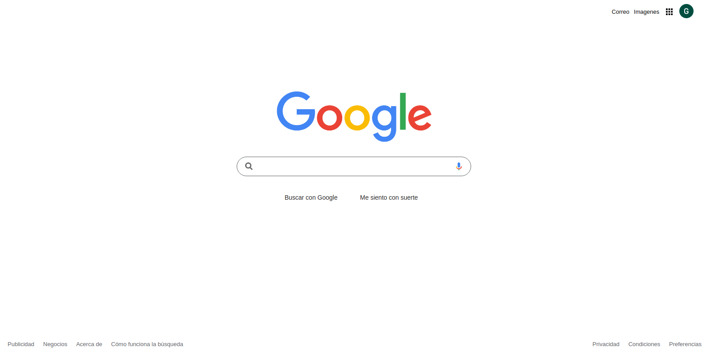

# Proyecto Clon del Frontend de Google

## Descripción

Este proyecto consiste en la creación de un clon del frontend del buscador de Google. Se enfoca en replicar la interfaz de usuario limpia y minimalista del buscador, utilizando HTML para la estructura y CSS para los estilos.

## Características Principales

- Barra de búsqueda: Réplica de la barra de búsqueda de Google con animaciones y transiciones suaves.
- Estilos Responsivos: Diseño adaptable para garantizar una experiencia de usuario óptima en dispositivos de diferentes tamaños.

## Tecnologías Utilizadas

- HTML5: Utilizado para la estructura de la página web.
- CSS3: Aplicado para estilizar y dar formato a los elementos.

## Aprendizajes y Habilidades Adquiridas

Durante la realización de este proyecto, adquirí valiosos conocimientos y puse en práctica varias habilidades, entre las cuales destacan:

1. **Maquetado con HTML y Estilización con CSS:** Reforcé mis habilidades en la creación de estructuras HTML semánticas y en la aplicación de estilos con CSS para lograr el aspecto deseado.

2. **Diseño Responsivo:** Implementé un diseño responsive para garantizar que la interfaz se vea bien en una variedad de dispositivos, desde pantallas grandes de escritorio hasta dispositivos móviles.

3. **Git y Control de Versiones:** Utilicé Git para el control de versiones, realizando commits y creando ramas para organizar el desarrollo de manera eficiente.

4. **Resolución de Problemas:** Enfrenté y resolví desafíos relacionados con la replicación de la interfaz de usuario de Google, mejorando mis habilidades de resolución de problemas.

## Capturas de Pantalla

*Interfaz de usuario del clon de Google.*

## Instalación

1. Clona el repositorio: `https://github.com/geoMerDev/clon-google`
2. Abre el archivo `index.html` en tu navegador.

